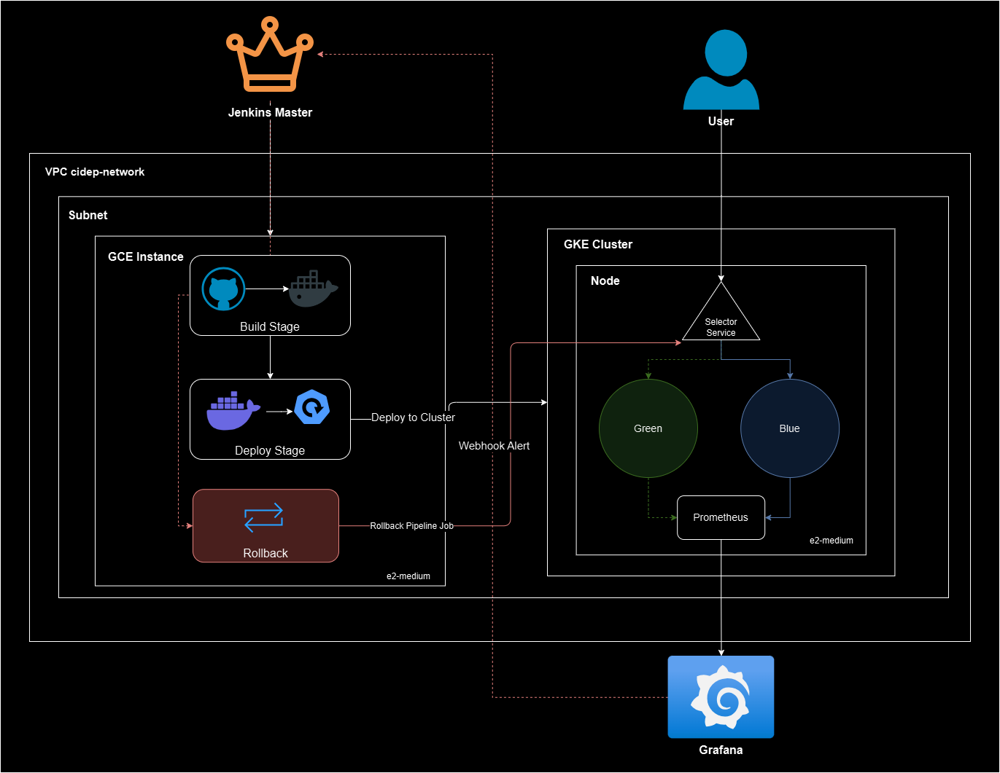

# CI/CD Pipeline with Blue-Green Deployments and Automated Rollbacks

## Project Overview

This project demonstrates a comprehensive CI/CD pipeline implementation, focusing on blue-green deployments and automated rollbacks for Kubernetes-based applications. By leveraging Jenkins, Terraform, Docker, Kubernetes, and Prometheus, this pipeline automates the process of building, deploying, monitoring, and rolling back applications to ensure high availability and minimal downtime.

## Architecture

The architecture consists of a GKE cluster for Kubernetes deployments and a GCE instance serving as a Jenkins agent for running pipeline jobs. Terraform provisions both environments, allowing cloud resources to be managed through single `apply` and `destroy` commands. The pipeline automates deployment through Jenkins, utilizing blue-green deployments to reduce downtime and ensure stable rollbacks in case of errors.

### Key Components

- **Jenkins**: CI/CD server orchestrating the pipeline stages.
- **Terraform**: Infrastructure-as-Code for provisioning cloud resources.
- **Docker**: Containerizes the application for deployment.
- **Kubernetes**: Hosts the application with blue-green deployment strategies.
- **Prometheus & Grafana**: Monitors application health and triggers alerts for automated rollbacks.

---

## Pipeline Workflow

### Pipeline Stages

1. **Checkout**

   Checks out the specific branch of the pipeline repository to use the latest pipeline configuration and Kubernetes manifests.

2. **Clone Repository**

   Clones the application repository, ensuring the latest application code and Dockerfile are used.

3. **Build Docker Image**

   Builds the application Docker image, tagging it with the Jenkins build ID for versioning.

4. **Push Image to Docker Hub**

   Pushes the Docker image to Docker Hub, authenticated via dockerhub-credentials.

5. **Configure gcloud**

   Configures GCP access using a service account key, setting the active project and authenticating kubectl for GKE resource management.

6. **Checkout 2**

   Ensures the latest deployment files from the pipeline repository are available for deployment.

7. **Deploy to GKE**

   Updates the deployment YAML with the new Docker image version, then applies blue-green.yaml and selector.yaml to GKE for blue-green deployment and rollback capabilities.

### Blue-Green Deployment Strategy

The pipeline is designed to deploy new application versions in separate "blue" and "green" environments. Traffic is initially routed to the current stable version (e.g., blue), and once the green version passes health checks, traffic is shifted. In the event of failure, the pipeline quickly rolls back, routing traffic to the stable blue environment.

### Rollback Strategy

This project employs a flexible rollback strategy that is triggered automatically upon receiving an alert from Grafana Alertmanager. The rollback mechanism leverages Jenkins to toggle the service selector between the "blue" and "green" deployments, regardless of the specific nature of the alert (e.g., latency, error rates, failed deployment).

**How Rollback Works**

- **Trigger**: Any alert configured in Grafana Alertmanager will send a webhook notification to the Jenkins pipeline designated for rollback actions.
- **Selector Toggle**: Upon triggering, Jenkins executes a rollback job that:
    - Retrieves the current selector version in Kubernetes for the service (e.g., blue or green).
    - Switches the selector to the alternative version (e.g., from blue to green or vice versa).
- **Automation**: This approach ensures that traffic is automatically redirected to the last known stable deployment (either "blue" or "green") without requiring manual intervention. It provides a quick and flexible response to any issues that trigger an alert, minimizing service downtime.

---

## Monitoring and Alerting

Prometheus and Grafana Alertmanager are configured to monitor key metrics (latency, error rate, traffic, and saturation) and trigger alerts. Grafana dashboards provide a visual overview of application performance, and its Alertmanager notifies relevant channels (e.g., email, Slack) if issues are detected, prompting automated rollbacks as necessary.

### Alerting Rules

These are sample alert rules that can be configured for monitoring, however in this setup, any alert can trigger a rollback.

- **Latency Threshold**: Alerts if response times exceed predefined limits.
- **Error Rate**: Triggers an alert for high error rates, ensuring immediate attention.

### Alert Configuration

For a similar setup, ensure that alerts in Grafana Alertmanager are configured with a webhook that points to the Jenkins job URL dedicated to this rollback process. The webhook URL in Grafana should look like this:

`http://<jenkins-url>/job/rollback-pipeline/build?token=your_token`

Replace `<jenkins-url>` with the actual URL of your Jenkins server and set up a secure token as required by your Jenkins configuration.

---

## Setup Guide

### Prerequisites

- **Docker** and **Docker Hub** account
- **Kubernetes** cluster (GKE) and **GCE** instance
- **Jenkins** server and multibranch pipeline setup
- **Terraform** for infrastructure provisioning

### Setup Steps

1. **Infrastructure**:
   - Provision the GCE instance and GKE cluster with Terraform.
   - Configure the GCE instance as a Jenkins agent.
2. **Pipeline**:
   - Use a multibranch Jenkins pipeline to pull the `Jenkinsfile`.
   - Configure the Docker registry credentials and Kubernetes cluster connection.
3. **Kubernetes Deployments**:
   - Apply the `blue-green-deployment.yaml` and `service.yaml` files to manage deployments and services.

---

## Troubleshooting Guide

- **Pipeline Build Failures**: Ensure Jenkins has access to the Docker registry and Kubernetes cluster.
- **Deployment Issues**: Verify Kubernetes manifests are correctly defined, and ensure the service selectors match the deployment labels.
- **Alert and Rollback Configuration**: Validate Prometheus and Alertmanager configuration for accurate monitoring.

---

## Screenshots and Diagrams

- **Architecture Diagram**: Depicting CI/CD stages, Kubernetes blue-green switching, and pipeline execution flow.

- **Jenkins Pipeline Execution**: Screenshot of a successful pipeline job for the main Jenkinsfile.

- **Grafana Dashboard**: For a demonstration of a more robust monitoring setup, visit one of my earlier projects.

   [myNX](https://github.com/Josheleazar/myNX)

---

## Lessons Learned

During development, configuring the Jenkins agent and multibranch pipeline was challenging, as this was a new experience. After 66 failed builds, the pipeline successfully ran on the 67th attempt, highlighting the importance of persistence and iterative debugging. Future improvements could include optimizing the deployment speed and refining alerting thresholds.

---

## Evaluation and Reporting

### Performance Metrics

- Document deployment latency, error rates, and overall pipeline efficiency.
- Analyze CI/CD optimizations and potential future improvements.

## Contact Information
Feel free to reach out if you have any questions or need further assistance:

Name: Josh Eleazar

Email: joelson30.j@gmail.com

LinkedIn: https://www.linkedin.com/in/josheleazar/

